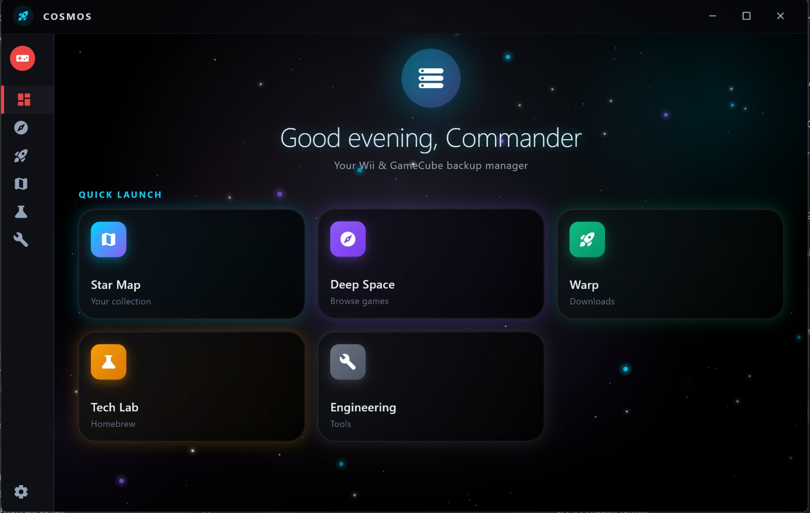
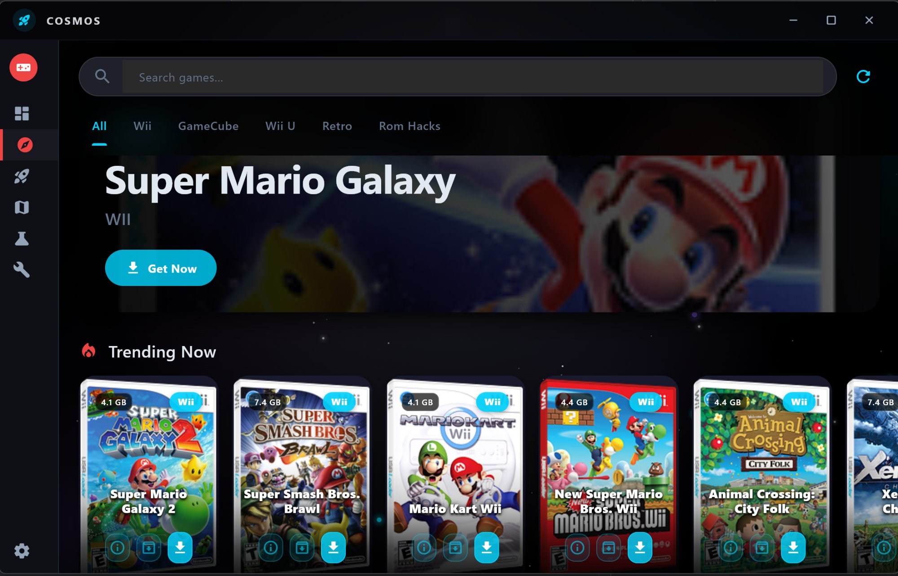
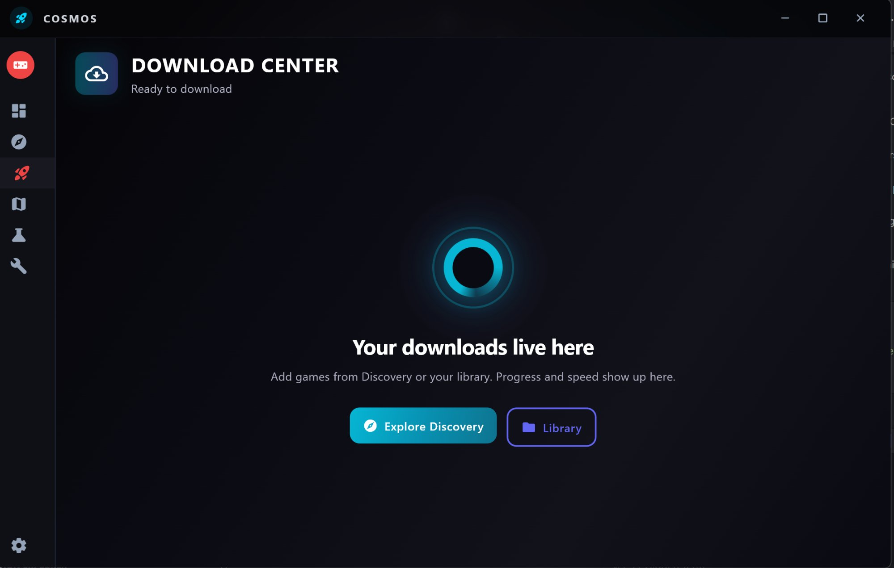
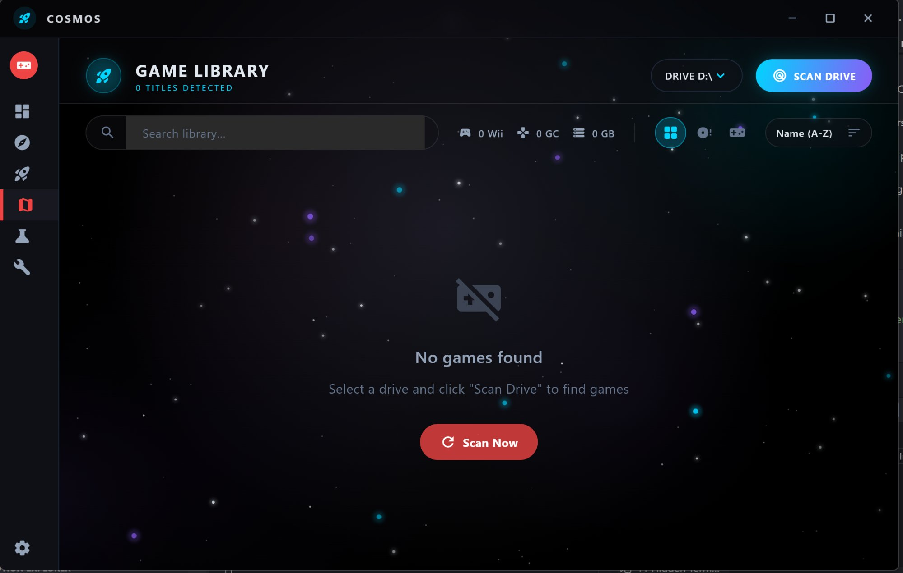
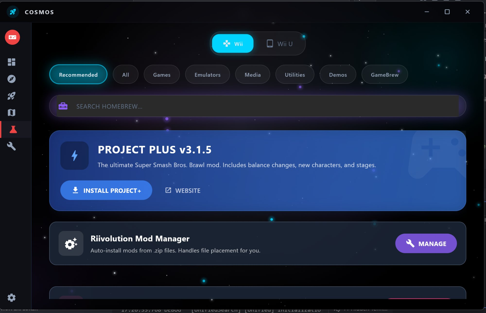
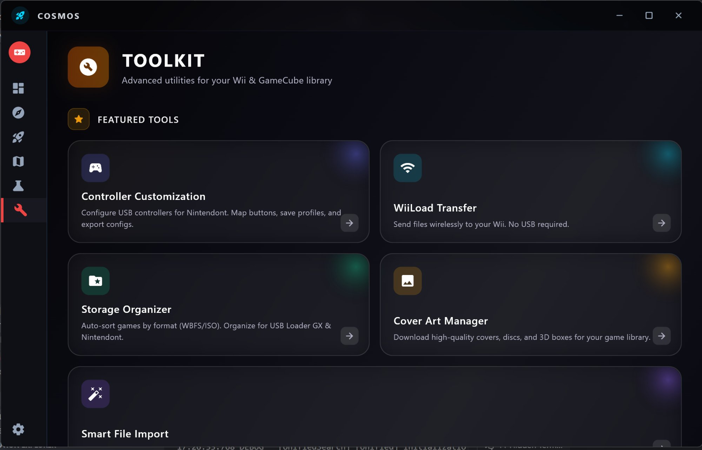
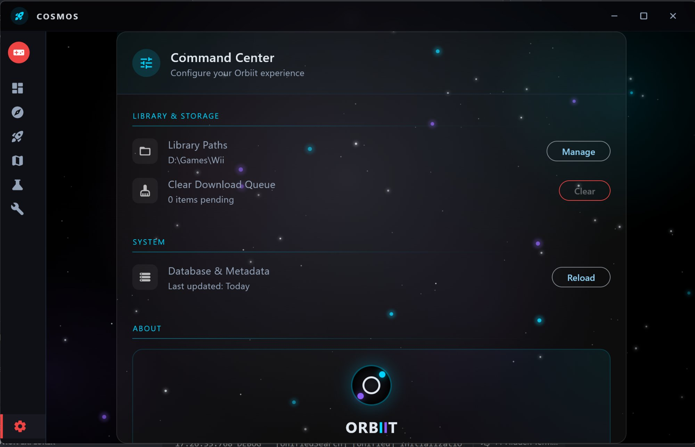

<div align="center">

# 🌌 ORBIIT

### *Your Wii & GameCube Collection, Reimagined*

**Premium backup management with a cosmic touch**

[](https://github.com/drewk312/Orbiit/releases)
[](https://github.com/drewk312/Orbiit/releases/latest)
[](LICENSE)
[](https://flutter.dev)

**[📥 Download Latest](https://github.com/drewk312/Orbiit/releases/latest)** • **[📖 Documentation](docs/)** • **[💬 Discussions](https://github.com/drewk312/Orbiit/discussions)** • **[🐛 Report Bug](https://github.com/drewk312/Orbiit/issues)**

---



</div>

---

## 🎯 What is Orbiit?

**Orbiit** (formerly WiiGCFusion) is a next-generation backup manager designed for **your personal Wii & GameCube game library**. Built with Flutter and powered by a native C++ core, Orbiit combines stunning visual design with enterprise-grade performance.

### ⚡ Why Choose Orbiit?

- **🎨 Beautiful Interface** - Modern glassmorphic UI with smooth animations and a space-themed design
- **🚀 Blazing Fast** - Native performance with multi-threaded scanning and optimized caching
- **🎮 Complete Solution** - Library management, game discovery, homebrew integration, and advanced tools
- **🔒 Privacy First** - Completely local, no telemetry, your data never leaves your machine
- **🛠️ Power User Tools** - Controller mapping, mod management, storage organization, and more
- **📦 One Click Setup** - No complex configuration, works out of the box

---

## 📸 Screenshots

<div align="center">

### Dashboard - Command Center
Your mission control for managing your entire collection


---

### Deep Space - Game Discovery
Browse, search, and download from curated collections



---

### Warp Drive - Download Center
Real-time download management with queue control



---

### Star Map - Your Library
Manage your collection with powerful filtering and sorting



---

### Tech Lab - Homebrew Hub
One-click installation for homebrew apps and mods



---

### Engineering Bay - Advanced Tools
Professional-grade utilities for power users



---

### Command Center - Settings
Fine-tune your Orbiit experience



</div>

---

## ✨ Features

### 🎮 Library Management
- **Intelligent Scanning** - Automatically detect games across all drives
- **Multi-Format Support** - WBFS, ISO, RVZ, GCM, CISO, and more
- **Beautiful Grid View** - Cover art with metadata (title, region, file size)
- **Advanced Filtering** - By platform (Wii/GameCube), region (NTSC-U/PAL/NTSC-J), or custom searches
- **Batch Operations** - Multi-select for mass deletion and organization
- **Metadata Enrichment** - Automatic cover art and game info from GameTDB

### 🌌 Game Discovery (Deep Space)
- **Curated Collections** - Featured and trending games
- **Platform Tabs** - Filter by Wii, GameCube, Wii U, Retro, or Rom Hacks
- **Instant Download** - One-click downloads from trusted sources
- **Rich Game Cards** - File sizes, ratings, and beautiful box art

### 📥 Download Management (Warp Drive)
- **Queue System** - Add multiple games and download in sequence
- **Progress Tracking** - Real-time speed, progress bars, and ETA
- **Smart Caching** - Resume interrupted downloads
- **Background Downloads** - Continue working while games download

### 🏠 Homebrew Integration (Tech Lab)
- **Featured Apps** - Project Plus, Riivolution Mod Manager, and more
- **One-Click Install** - Automatic file placement and configuration
- **Category Browsing** - Games, Emulators, Media, Utilities, Demos, GameBrew
- **Searchable Database** - Find exactly what you need

### 🔧 Advanced Toolkit (Engineering Bay)
- **Controller Customization** - Map buttons for USB controllers on Nintendont
- **WiiLoad Transfer** - Wireless file transfer to Wii (no USB needed)
- **Storage Organizer** - Auto-sort games by format (WBFS/ISO) for USB Loader GX
- **Cover Art Manager** - Download high-res covers, discs, and 3D boxes
- **Smart File Import** - Intelligent organization for manual imports

### ⚙️ Command Center (Settings)
- **Library Paths** - Manage scan locations
- **Download Queue** - View and clear pending downloads
- **Database Management** - Reload metadata when needed
- **Theme Customization** - Midnight Aurora design system

---

## 🚀 Installation

### Quick Start (Recommended)

1. **Download** the latest release from [Releases](https://github.com/drewk312/Orbiit/releases/latest)
2. **Extract** the ZIP to your preferred location (e.g., `C:\Games\Orbiit`)
3. **Run** `Orbiit.exe` 
4. **Scan** your games by selecting a drive and clicking "Scan Drive"

That's it! Orbiit will automatically detect your games and fetch metadata.

### System Requirements

- **OS**: Windows 10/11 (64-bit), macOS 10.15+, or Linux (Ubuntu 20.04+)
- **RAM**: 4GB minimum, 8GB recommended
- **Storage**: 500MB for app + space for your game library
- **Internet**: Required for game discovery and metadata

---

## 🛠️ Building from Source

### Prerequisites

- [Flutter SDK](https://flutter.dev/docs/get-started/install) 3.0+
- [Visual Studio 2022](https://visualstudio.microsoft.com/) (Windows) with C++ workload
- [CMake](https://cmake.org/) 3.15+
- [Git](https://git-scm.com/)

### Build Steps

```bash
# 1. Clone the repository
git clone https://github.com/drewk312/Orbiit.git
cd Orbiit

# 2. Install Flutter dependencies
flutter pub get

# 3. Build native C++ core (Windows example)
cd native
mkdir build && cd build
cmake .. -G "Visual Studio 17 2022" -A x64
cmake --build . --config Release
cd ../..

# 4. Run in debug mode
flutter run -d windows

# 5. Build release version
flutter build windows --release
```

The compiled app will be in `build/windows/runner/Release/`

### Platform-Specific Notes

**macOS**: Requires Xcode 13+ and CocoaPods
```bash
cd macos
pod install
cd ..
flutter build macos --release
```

**Linux**: Requires build essentials
```bash
sudo apt-get install clang cmake ninja-build pkg-config libgtk-3-dev
flutter build linux --release
```

---

## 📂 Project Structure

```
Orbiit/
├── lib/
│   ├── main.dart                 # Application entry point
│   ├── screens/
│   │   ├── home/                 # Dashboard (Command Center)
│   │   ├── discovery/            # Game browser (Deep Space)
│   │   ├── downloads/            # Download manager (Warp)
│   │   ├── library/              # Game library (Star Map)
│   │   ├── homebrew/             # Homebrew apps (Tech Lab)
│   │   ├── toolkit/              # Advanced tools (Engineering)
│   │   └── settings/             # Configuration
│   ├── models/                   # Data models
│   ├── services/                 # Business logic
│   │   ├── game_scanner.dart
│   │   ├── download_service.dart
│   │   ├── metadata_service.dart
│   │   └── cache_manager.dart
│   ├── widgets/                  # Reusable UI components
│   └── utils/                    # Helper functions
├── native/                       # C++ native code (forge_core)
├── screenshots/                  # App screenshots
└── docs/                         # Documentation
```

---

## ⚖️ Important Legal Notice

<div align="center">

### **Orbiit is for managing YOUR PERSONAL BACKUPS**

This software is designed exclusively for organizing and managing backup copies of games **you legally own**.

**Orbiit does NOT:**
- ❌ Provide or distribute ROM files
- ❌ Facilitate piracy in any form
- ❌ Circumvent copy protection
- ❌ Include any copyrighted game content

**Users are solely responsible for:**
- ✅ Ensuring they own physical copies of games they backup
- ✅ Complying with all local copyright laws
- ✅ Understanding and following fair use provisions in their jurisdiction

**Disclaimer:** Orbiit is an independent project and is not affiliated with, endorsed by, or connected to Nintendo, any game publishers, or console manufacturers.

📄 [Read Full Legal Terms](LEGAL.md)

</div>

---

## 🐛 Known Issues (v1.01 Beta)

We're actively working on squashing bugs. Here are known issues:

- **Myrient Download Issues**: Intermittent connection problems (working on multi-source fallback)
- **Large Library Performance**: Scanning 1000+ games can be slow (optimization in progress)

See the full list on our [Issues page](https://github.com/drewk312/Orbiit/issues)

---

## 🗺️ Roadmap

### v1.1 (Coming Soon)
- [ ] Multi-source download fallback (solve Myrient connectivity issues)
- [ ] Custom theme system (user-created color schemes)
- [ ] Performance optimization for 1000+ game libraries
- [ ] Batch cover art download

### v1.2 (Planned)
- [ ] Advanced search with filters (genre, developer, year)
- [ ] Custom game collections and playlists
- [ ] Export library to CSV/JSON
- [ ] Improved mod manager with conflict detection

### v2.0 (Long-term Vision)
- [ ] macOS and Linux feature parity
- [ ] Dolphin emulator integration (launch games directly)
- [ ] Save state backup and sync (local network)
- [ ] Wii U format support (.wux, .wud)
- [ ] Plugin API for community tools

Vote on features in [Discussions](https://github.com/drewk312/Orbiit/discussions)!

---

## 🤝 Contributing

We welcome contributions from the community! Whether it's bug fixes, new features, documentation, or design improvements.

### How to Contribute

1. **Fork** the repository
2. **Create** a feature branch (`git checkout -b feature/AmazingFeature`)
3. **Commit** your changes (`git commit -m 'Add some AmazingFeature'`)
4. **Push** to the branch (`git push origin feature/AmazingFeature`)
5. **Open** a Pull Request

### Contribution Guidelines

- Follow Dart/Flutter style guidelines ([effective dart](https://dart.dev/guides/language/effective-dart))
- Write clear, descriptive commit messages
- Add tests for new features
- Update documentation as needed
- Be respectful and constructive in discussions

See [CONTRIBUTING.md](CONTRIBUTING.md) for detailed guidelines.

---

## 🙏 Credits & Acknowledgments

Orbiit wouldn't be possible without these amazing projects and communities:

### Core Technologies
- **[Flutter](https://flutter.dev)** - Beautiful, native cross-platform framework
- **[Dart](https://dart.dev)** - Client-optimized language
- **C++** - Native performance layer

### Data & Resources
- **[GameTDB](https://www.gametdb.com/)** - Comprehensive game metadata database
- **[Myrient](https://myrient.erista.me/)** - Game preservation and CDN hosting
- **[Dolphin Emulator](https://dolphin-emu.org/)** - Technical documentation and format specs

### Inspiration
- **TinnyWii** - Original codebase that inspired this project
- **Wii Backup Manager** - Classic tool that set the standard
- **USB Loader GX** - Community-driven homebrew excellence

### Community
- The entire **Wii/GameCube homebrew community** for keeping these consoles alive
- All our **beta testers** and bug reporters
- **Contributors** who've submitted PRs and improvements

---

## 📜 License

This project is licensed under the **MIT License** - see the [LICENSE](LICENSE) file for full details.

**TL;DR**: You can use, modify, and distribute this software freely, but it comes with no warranty.

---

## 💬 Community & Support

### Get Help
- 🐛 **Bug Reports**: [GitHub Issues](https://github.com/drewk312/Orbiit/issues)
- 💬 **Discussions**: [GitHub Discussions](https://github.com/drewk312/Orbiit/discussions)
- 📖 **Documentation**: [Wiki](https://github.com/drewk312/Orbiit/wiki) (coming soon)

### Stay Updated
- ⭐ **Star** this repo to get notified about releases
- 👀 **Watch** for updates and announcements
- 🍴 **Fork** to contribute

### Code of Conduct
We are committed to providing a welcoming and inclusive environment. Please read our [Code of Conduct](CODE_OF_CONDUCT.md).

---

## 📊 Stats

<div align="center">


</div>

---

<div align="center">

### 🌟 If you find Orbiit useful, please star the repository!

**Made with ❤️ by [Drew Kuiper](https://github.com/drewk312)**

*Powered by Flutter & Native C++ | Built for the Community*

[⬆ Back to Top](#-orbiit)

</div>
