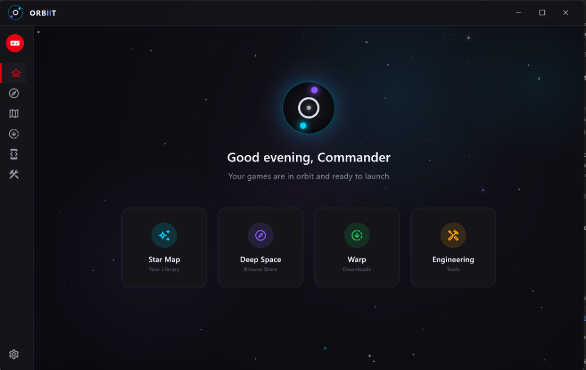
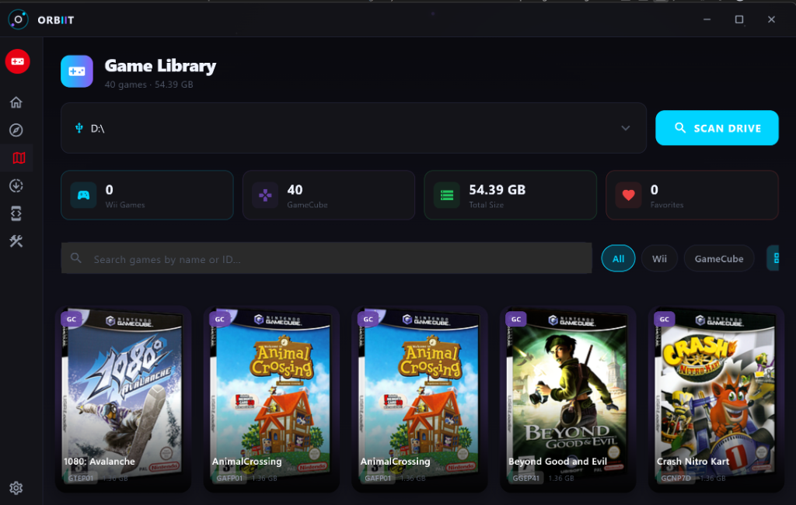
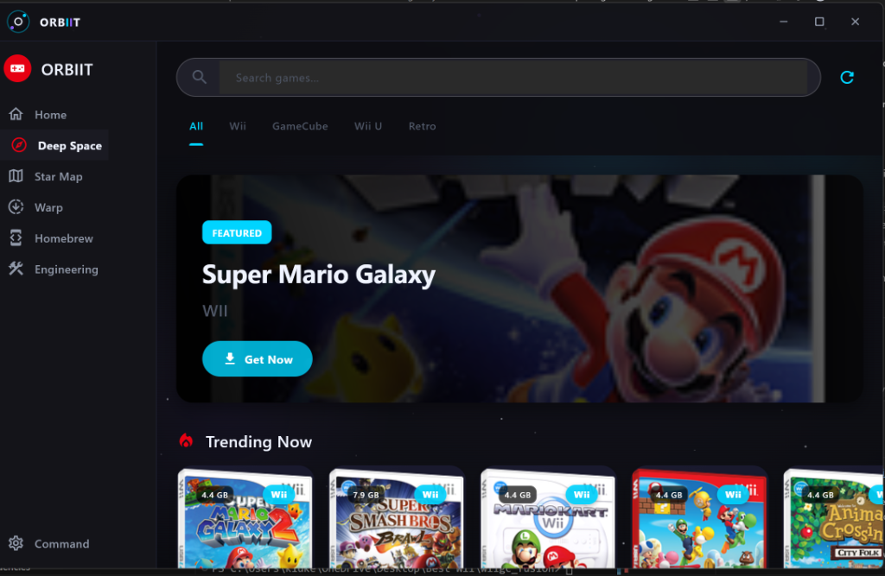
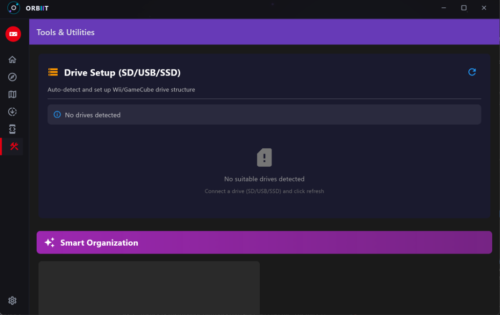
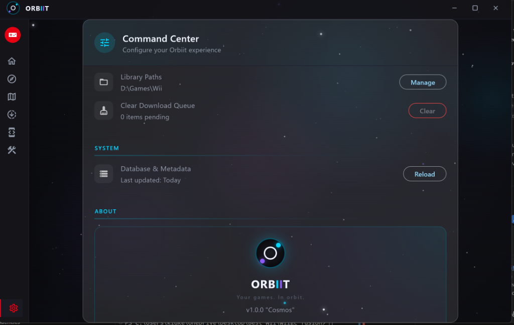

<div align="center">

# 🚀 ORBIIT

### *Experience Premium Game Library Management*

**Your Personal Collection. Elevated.**

[](https://github.com/drewk312/Orbiit/releases)
[](https://github.com/drewk312/Orbiit/releases)
[](LICENSE)
[](https://flutter.dev)

[📥 **Download**](https://github.com/drewk312/Orbiit/releases) • [📖 **Documentation**](docs/) • [💬 **Community**](https://github.com/drewk312/Orbiit/discussions) • [⚖️ **Legal**](LEGAL.md)

---

### 🌟 *The Ultimate Personal Game Archive*

Orbiit transforms how you organize and manage **your personal game backups**.  
Built with Flutter & C++, combining luxury design with enterprise-grade performance.

</div>

---

## ✨ Premium Features

<div align="center">

| Feature | Description |
|:-------:|:------------|
| 🎨 **Luxury Interface** | Glassmorphism UI, dynamic backgrounds, cinematic animations |
| ⚡ **Lightning Fast** | Native C++ engine for instant library scanning & management |
| 🔍 **Smart Organization** | AI-powered categorization and intelligent search |
| 🎯 **One-Click Operations** | Batch processing, automated backups, quick actions |
| 🛡️ **Secure & Private** | Local-first architecture, no telemetry, your data stays yours |
| 🎮 **Multi-Platform Ready** | Wii, GameCube support with more platforms planned |

</div>

---

## 🚀 Orbit Your Collection

<div align="center">

**Orbiit** brings your game library into perfect orbit.  
Navigate your personal backups with stellar organization and a cosmic interface that's out of this world.

</div>

### 🎯 Core Capabilities

*   **🎨 Premium Visual Design:** Luxury glassmorphism UI with fluid animations
*   **⚡ High-Performance Engine:** Custom C++ backend (`forge_core`) for rapid operations
*   **🔍 Intelligent Detection:** Automatic game discovery across all your drives
*   **📚 Smart Library:** Advanced filtering, sorting, and collection management
*   **🖼️ Beautiful Covers:** Automatic cover art fetching with fallback sources
*   **🔒 Privacy-First:** Completely offline capable, no tracking, no ads

---

## ⚖️ Important Legal Notice

<div align="center">

**Orbiit is for managing YOUR PERSONAL BACKUPS of games you legally own.**

This software does NOT provide, distribute, or facilitate piracy.  
Users are solely responsible for complying with copyright laws.

📄 [Read Full Legal Disclaimer](LEGAL.md)

*Orbiit is not affiliated with Nintendo or any game publisher.*

</div>


## 📸 Gallery

| **Command Center** | **Game Library** |
|:---:|:---:|
|  |  |

| **Deep Space Store** | **Hardware Wizard** |
|:---:|:---:|
|  |  |

| **Settings** | **Modern UI** |
|:---:|:---:|
|  |  |

## 📥 Installation


**Option 1: Download Release (Recommended)**

1.  Download the latest release ZIP from the [Releases page](https://github.com/drewk312/Orbiit/releases).
2.  Extract the ZIP to your preferred location (e.g., `C:\Games\Orbiit`).
3.  Run `Orbiit.exe`.
4.  Click **"Add Folder"** or go to **Settings > Drive Setup** to scan your games.

**Option 2: Build from Source**

```powershell
# Prerequisites: Flutter SDK, Visual Studio 2022 (C++), CMake

# 1. Clone
git clone https://github.com/drewk312/Orbiit.git
cd Orbiit

# 2. Install Dependencies
flutter pub get

# 3. Build Native Core
cd native
mkdir build && cd build
cmake ..
cmake --build . --config Release
cd ../..

# 4. Run
flutter run -d windows
```

## 🎮 Supported Systems

*   **Nintendo Wii** (.wbfs, .iso, .rvz)
*   **Nintendo GameCube** (.iso, .rvz, .gcm)
*   **Wii U** (.wux, .wud)
*   **Retro** (NES, SNES, N64, GBA, DS, and more via Libretro)

## 🙏 Credits & Acknowledgements

Orbiit stands on the shoulders of giants. Special thanks to:

*   **TinnyWii:** For providing the foundational codebase and inspiration.
*   **GameTDB:** For the extensive game metadata and cover art database.
*   **Myrient:** For game preservation and high-speed hosting.
*   **Dolphin Emulator:** For technical documentation and magic byte references.
*   **Flutter:** For the beautiful UI framework.

## 🤝 Contributing

We love contributions! Orbiit is open source and welcomes PRs, bug reports, and feature requests.

### How to Contribute

1. **Fork** the repository
2. **Create** your feature branch (`git checkout -b feature/AmazingFeature`)
3. **Commit** your changes (`git commit -m 'Add some AmazingFeature'`)
4. **Push** to the branch (`git push origin feature/AmazingFeature`)
5. **Open** a Pull Request

### Guidelines

- Follow the existing code style
- Write clear commit messages
- Add tests for new features
- Update documentation as needed
- Be respectful and constructive

See [CONTRIBUTING.md](CONTRIBUTING.md) for detailed guidelines.

## 📜 License

This project is licensed under the MIT License - see the [LICENSE](LICENSE) file for details.

## 🌟 Support

If you find Orbiit helpful, please consider:
- ⭐ Starring the repository
- 🐛 Reporting bugs
- 💡 Suggesting features
- 📢 Sharing with friends

## 📞 Contact & Community

- **Issues:** [GitHub Issues](https://github.com/drewk312/Orbiit/issues)
- **Discussions:** [GitHub Discussions](https://github.com/drewk312/Orbiit/discussions)
- **Code of Conduct:** [CODE_OF_CONDUCT.md](CODE_OF_CONDUCT.md)

---

<div align="center">

**Made with ❤️ by the Orbiit Team**

*Powered by Flutter & C++ Native Interop*

[⬆ Back to Top](#orbiit)

</div>
